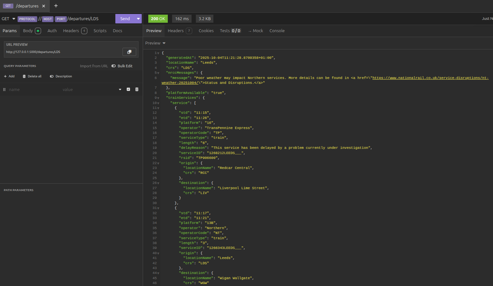
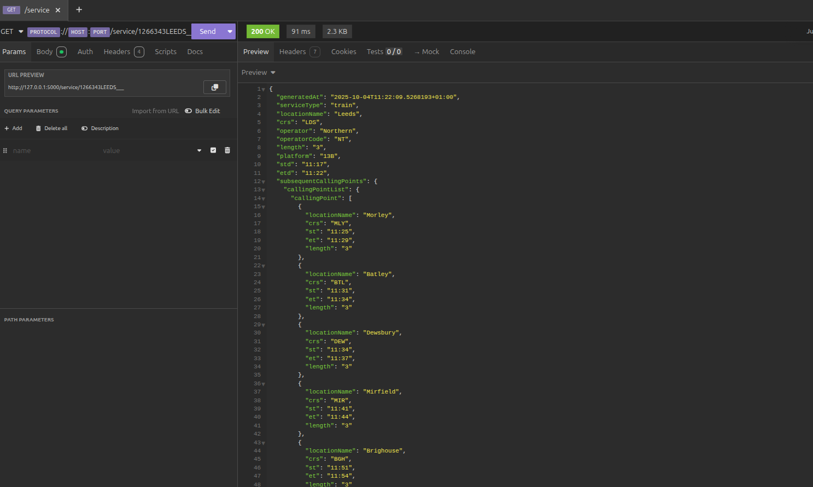

# 🚂 National Rail JSON API

A RESTful JSON API acting as a proxy to National Rail's LDBWS (Live Departure Board Web Service) written using NodeJS & TypeScript

The underlying API (Darwin) uses a [SOAP](https://en.wikipedia.org/wiki/SOAP) protocol and can be perticulaly tricky when using on a frontend application.

This app is built specifically to use [OpenLDBWS/ldb11](https://lite.realtime.nationalrail.co.uk/OpenLDBWS/ldb11.asmx)

<div style="display: flex; flex-direction: column; justify-content: center; align-items: center; height: 100vh;">
   
   <p style="text-align: center;"> Example of departing trains from Leeds </p>
</div>

<div style="display: flex; flex-direction: column; justify-content: center; align-items: center; height: 100vh;">
   
   <p style="text-align: center;"> Example of train service and next/previous stops </p>
</div>

## What is LDBWS?

From [their documentation](https://lite.realtime.nationalrail.co.uk/OpenLDBWS/):
> LDBWS provides a request-response web service to access real time train information from Darwin. This is the same information that powers the Live Departure Boards, provided in XML format.
## Features

This application acts as a modern JSON wrapper around LDBWS, providing:

- **XML to JSON conversion**
- **RESTful API**
- **Real-time Darin data**
- **Filtering options**

## API Endpoints
Swagger documentation is available at the root of the app. The currently supported routes are:

```bash
GET /arrivals/:crs
GET /arrivals/:crs/detailed
GET /departures/:crs
GET /departures/:crs/detailed
GET /arrivals-and-departures/:crs
GET /arrivals-and-departures/:crs/detailed
GET /service:serviceId
```

## Example Usage

```bash
# Get departures from Leeds showing the next 10 services
curl "http://localhost:3000/departures/LDS?numRows=10"

# Get arrivals at Bradford Interchange from Leeds
curl "http://localhost:3000/arrivals/BDI?filterCrs=LDS&filterType=from"
```

## Getting Started

1. **Prerequisites**
   - Node v22.20.0
   - [pnpm](https://pnpm.io/)
   - A Darwin API token is needed from [National Rail Enquiries](http://www.nationalrail.co.uk/100296.aspx)

2. **Setup**
   ```bash
   pnpm install

   # Add your environemnt variables from .env.example
   cp .env.example .env
   
   # Start development server
   pnpm dev
   ```

## Built With
- [Koa](https://koajs.com/) for API routing
- [Wilson](https://www.npmjs.com/package/winston) for logging
- [Biome](https://biomejs.dev/) for linting
- [Vitest](https://vitest.dev/) as the testing framework of choice
- [Lefthook](https://lefthook.dev/) from pre-commit checks
